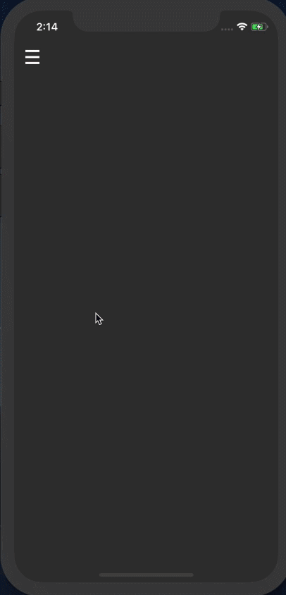

# 3D Sidebar Menu Animation

Created a animated navigation sidebar using this [tutorial](https://www.raywenderlich.com/1782844-create-a-cool-3d-sidebar-menu-animation)

## Core Concepts I Learned
* View controller containment
* UIScrollView implicit content size
* Delegate Pattern
* Perspective changes with *CATransform3D* and *m34*

